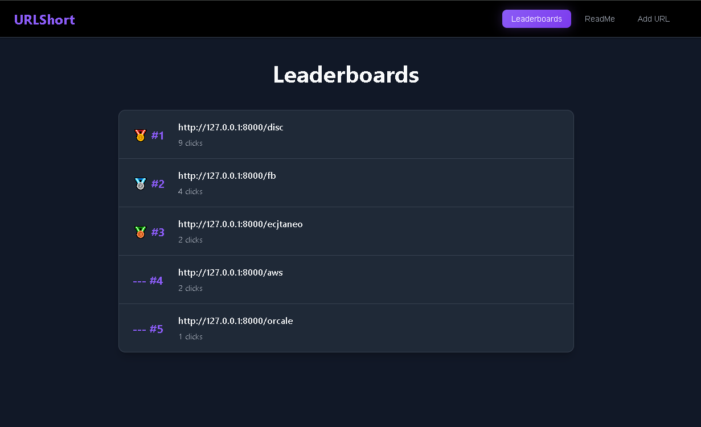
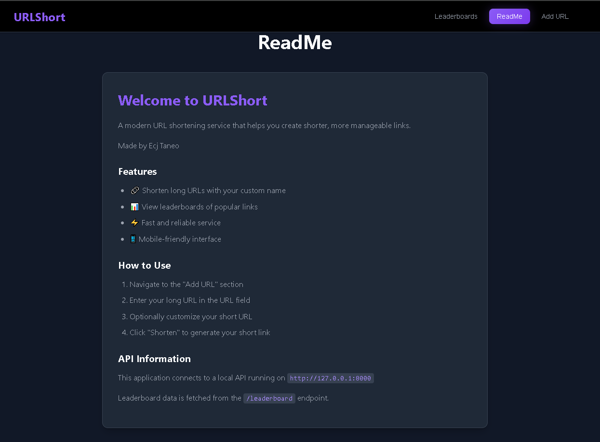
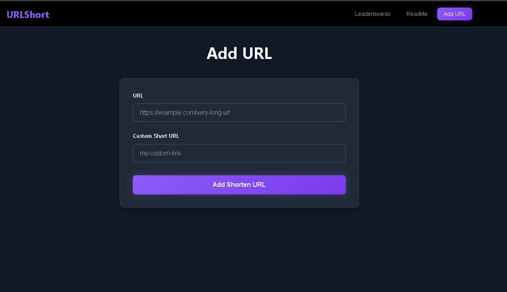
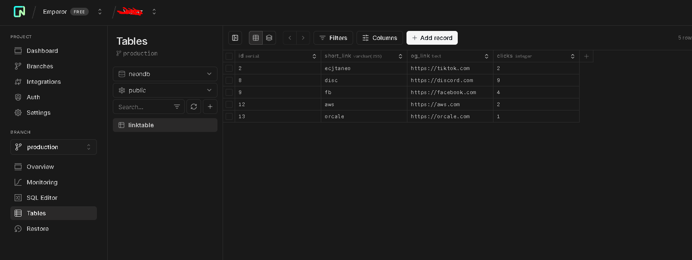

# 🔗 Custom URL Shortener (mvp)

A simple and secure URL shortener service that lets users create their own custom short links (if the name is available), view leaderboards of the most-clicked links, and enjoy a smooth frontend experience.

This project is built with a **backend-first mindset**—the frontend was *heavily assisted by AI (~80%)* while I focused on building backend.

---

## ✨ Features

* 🔥 **Custom Short URLs**
  * Users can shorten their URLs and choose their own custom alias (if available).
* 📊 **Leaderboard**
  * See the top links with the highest number of clicks/views.
* 🛡️ **Security**
  * Secured with [Helmet](https://helmetjs.github.io/) and best practices to prevent common web vulnerabilities.
* 🛠️ **Validation**
  * Robust input validation using [Joi](https://joi.dev/).
* 🚫 **No Auth Required**
  * Anyone can shorten URLs and view stats—no accounts or sign-in needed.
* 🌐 **Frontend & Backend Separation**
  * Backend (Express.js) and frontend are in separate folders and communicate via REST API.

---

## 🛠 Tech Stack

**Backend**

* [Express.js](https://expressjs.com/) - Web framework  
* [Neon](https://neon.com/) - Serverless PostgreSQL (Free Tier)  
* [PostgreSQL](https://www.postgresql.org/) - Database  
* [Joi](https://joi.dev/) - Input validation  
* [Helmet](https://helmetjs.github.io/) - Security middleware  
* [CORS](https://developer.mozilla.org/en-US/docs/Web/HTTP/CORS) - To enable frontend-backend separation  

**Frontend**

* Vanilla JS / HTML / CSS  
* *80% generated with AI assistance (thanks v0.dev)* 🎨

---

## 📸 Screenshots

<p align="center">
  
</p>

<p align="center">
  
</p>

<p align="center">
  
</p>

<p align="center">
  
</p>

---

## 📂 Project Structure

```
├── backend/          # Express.js server
│   ├── routes/
│   ├── controllers/
│   ├── models/
│   └── app.js
├── frontend/         # Static frontend
│   ├── index.html
│   ├── scripts.js
│   └── styles.css
└── README.md
```


## 🚀 Getting Started

### 1️⃣ Backend Setup

```bash
cd backend
npm i express cors dotenv joi helmet pg express-rate-limit cookie-parser
node --watch app
```

Make sure Neon DB is configured properly. Create the necessary tables with the provided SQL schema.

### 2️⃣ Frontend Setup

```bash
cd frontend
# Open index.html directly in your browser
```

Or serve with a simple HTTP server:

```bash
npx serve
```

---

## 📢 Notes

* No authentication means anyone can use it—designed for quick, frictionless URL shortening.
* The frontend is kept minimal since the focus was on backend logic and API design.
* Will add reCaptcha if serious about this

---

## 📃 License

This project is licensed under the MIT License. See [LICENSE](./LICENSE) for details.
